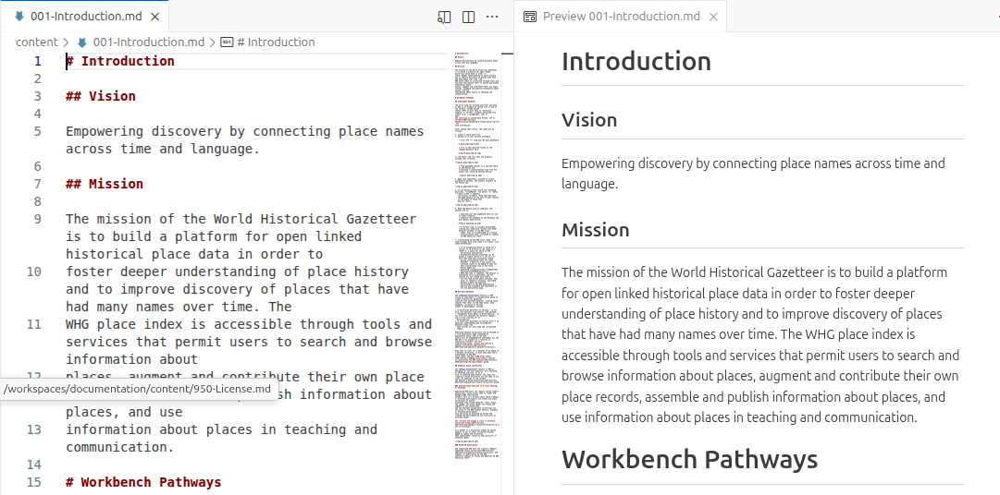

# World Historical Gazetteer Documentation

This repository contains the source files and build workflow for the **World Historical Gazetteer** documentation site.

The documentation is written in **Markdown** and **reStructuredText**, built with **Sphinx**, and automatically deployed to **GitHub Pages**.

**Live site:** <https://WorldHistoricalGazetteer.github.io/documentation/>

---

## Getting Started (WHG Team Members)

The easiest way to contribute is by using a **GitHub Codespace**, which provides a pre-configured development environment with all dependencies already installed.

### 1. Launch Codespace

Click the green **"Code"** button and select the **"Codespaces"** tab to launch a new, ready-to-use development environment directly in your browser.

### 2. Edit and Preview

Once the Codespace loads, you can:

1.  **Edit existing documentation** files (`.md` or `.rst`) or add new ones. The console has settings (set with the buttons top-right of the editing pane) which generate a preview as you type.

>>   


3.  **Start the live preview** which automatically rebuilds the entire documentation site when files change:
    ```bash
    ./start_preview.sh
    ```
4.  **View the preview:** The Codespace will automatically prompt you to open a **"Simple Browser"** to view the assembled documentation on port 8000.
5.  **Exit Preview:** Before committing changes, press **`Ctrl + C`** in the terminal to **stop the preview server and regain control of the command line**.
6.  **Stop Working:** When you are completely finished, remember to **stop the Codespace** (using the **`Codespaces: Stop Current Codespace`** command in the Command Palette or the "Stop" button on the GitHub Codespaces page) to avoid unnecessary charges.

### 3. Commit and Deploy (Direct to Main)

1.  After making and previewing your changes, use the helper script to stage, commit, and push them **directly to the `main` branch**:
    ```bash
    ./git_push_docs.sh
    ```
2.  The script automatically generates a commit message and pushes the changes.
3.  The push will immediately trigger the GitHub Action, and the live documentation site will update automatically shortly after.

---

## ⚠️ Codespaces Billing Note

As this is a public repository, Codespaces usage is billed to the **individual collaborator's GitHub account**.

* **Free Usage:** All GitHub Free accounts receive a generous 120-hour monthly quota of compute time and 15GB of storage in Codespaces. For casual documentation updates, your usage will almost certainly remain within this free limit, resulting in **zero cost** to you. Details [here](https://docs.github.com/en/billing/concepts/product-billing/github-codespaces).
* **Cost Avoidance:** The key to avoiding charges is to **stop your Codespace** when you are finished working (see step 2.5 above). While Codespaces automatically times out after a 30 minutes of inactivity, explicitly stopping it can save your free compute hours.

---

## Repository Structure

| File/Folder | Description |
| :--- | :--- |
| `index.md` | Main landing page for the documentation. |
| `conf.py` | Sphinx configuration file. |
| `Makefile` | Minimal Sphinx build commands (`make html`, `make clean`). |
| `requirements.txt` | Python dependencies required for building the documentation. |
| `start_preview.sh` | Script to run `sphinx-autobuild` for live preview in Codespace. |
| `git_push_docs.sh` | Script to stage, commit, and push documentation updates directly to `main`. |
| `_templates/` | Sphinx templates (optional for custom themes). |
| `_static/` | Static assets (CSS, images, etc.). |
| `.github/workflows/` | GitHub Actions workflow for building and deployment. |
| **Source files** | Markdown (`.md`) or reStructuredText (`.rst`) at the root or in subfolders. |
| **Build output** | `_build/html/` (generated by Sphinx, **not committed**). |

---

## Local Development (Alternative)

If you prefer to work locally, ensure you have Python 3.9+ and Git installed, and install the dependencies from `requirements.txt`.

1.  **Clone the repository:**
    ```bash
    git clone [https://github.com/WorldHistoricalGazetteer/documentation.git](https://github.com/WorldHistoricalGazetteer/documentation.git)
    cd documentation
    ```
2.  **Install dependencies:**
    ```bash
    pip install -r requirements.txt
    ```
3.  **Build and view:**
    ```bash
    make clean
    make html
    # Open _build/html/index.html in your browser to check edits
    ```
4.  **Commit and push** your changes to `main`.

---

## GitHub Actions Deployment

Once changes are merged into `main`:

* **GitHub Actions automatically:**
    1.  Installs dependencies.
    2.  Builds the Sphinx documentation.
    3.  Deploys `_build/html` to the `gh-pages` branch.
    4.  Updates the live GitHub Pages site.
* **No manual deployment is needed.**