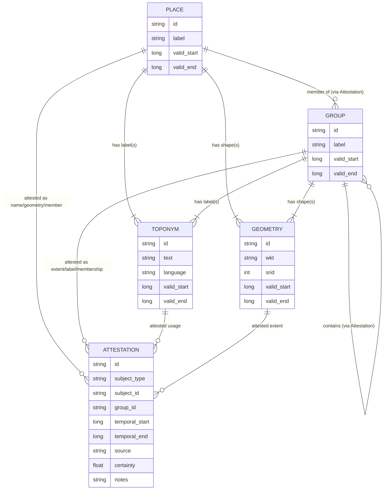
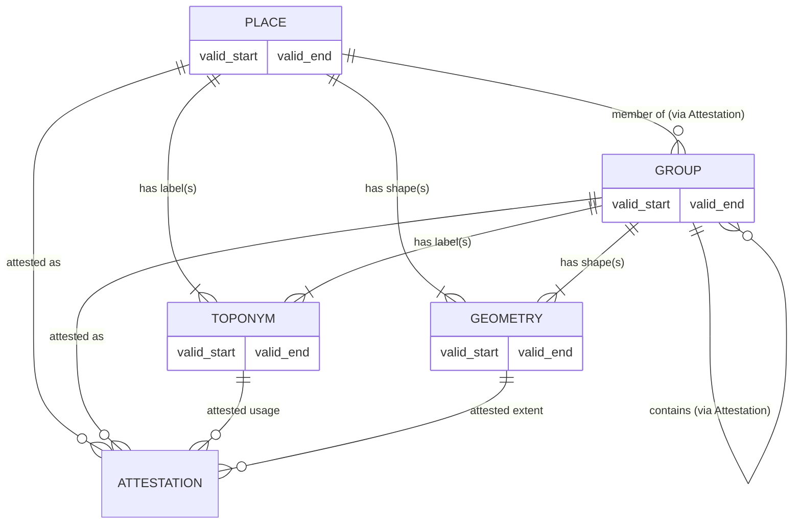

### 🧭 WHG Temporal Entity–Relationship Model

This diagram shows the **core entities** in the World Historical Gazetteer data model
and how they interrelate in both **conceptual** and **temporal** terms.

- **Entities** (`Place`, `Group`, `Toponym`, `Geometry`) each have intrinsic life-spans  
  represented by `valid_start` / `valid_end`.
- **Attestation** is the evidential link type that records *temporal relationships* between entities:
  - A *name* (Toponym ↔ Place/Group)
  - A *spatial representation* (Geometry ↔ Place/Group)
  - A *membership* (Place ↔ Group or Group ↔ Group)
  - Each Attestation carries its own `temporal_start` / `temporal_end`, source, and certainty.
- This separation supports reasoning about both the **existence** of entities and the
  **historical evidence** connecting them.

### 🧭 WHG Core Temporal Model (Simplified)

**Concept:**  
All entities — *Places, Groups, Toponyms,* and *Geometries* — have intrinsic validity ranges.  
**Attestations** record temporal evidence of relationships between them (names, extents, memberships).

