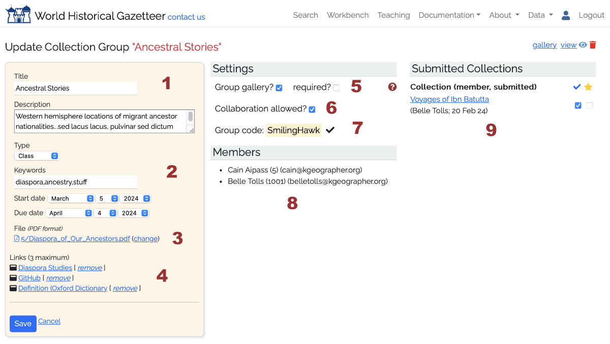

# Collection Groups

## Create and manage a Collection Group for a class or workshop

The **Collection Group** feature in WHG is designed primarily for instructional scenarios, but can also be used for
workshops. Any registered user can request "group leader" permissions, which allow them to create and manage a WHG
Collection Group. This is a private space where students or workshop participants can create and share collections of
places (WHG Place Collections), annotated with custom keywords, notes, dates, and images. The group leader can review
submitted collections, and can nominate exceptional collections for inclusion in the WHG Student Gallery. Students or
workshop participants join the group by entering an access key created and distributed by the instructor or workshop
leader.

The workflow in both cases is very similar:

* Request group leader privileges using the site-wide contact form.
* On your "My Data" dashboard, a plus sign (+) appears in the "Collection Groups" box.

* Add a new Collection Group by filling the required fields in the form. Upon save, you are brought to the "Update
  Collection Group" screen where you will configure the group and manage submissions.

1. Edit title and description.
2. Choose type (class or workshop), add keywords, start date and if applicable, due date.
3. Upload a file (PDF format) with the course or workshop description, requirements, etc.
4. Add up to 3 links to external web resources.
5. Will this class/workshop have a gallery of completed works, visible to its members after completion? If so, are all
   submissions required to appear in it?
6. Are collaborators permitted?
7. Generate a group signup code and distribute it to students/participants, who join by entering the code on their own
   dashboard.
8. As members join, they appear on this list
9. For each submission, flag as 'reviewed' and if appropriate, nominated for the WHG Student Gallery.

* When a student/participant enters the group code in their _My Data_ dashboard, they get access to the PDF guide you
  have created, with guidelines for this particular exercise—the theme, or goals. **NOTE: Technical instructions for
  creating a [Place Collection](publishing.md#create-and-publish-a-place-collection) are covered in site documentation and
  need not be included in this group guide.**
* As collections are submitted to the group, they are listed (9) and you can review them and nominate them for inclusion
  in the WHG Student Gallery (in development).
* Communication between instructor/leader and students/participants is left to normal email and/or course management
  software if applicable.