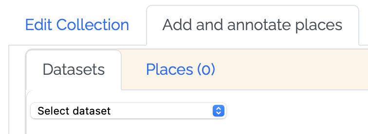
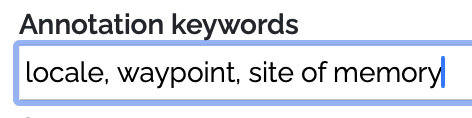
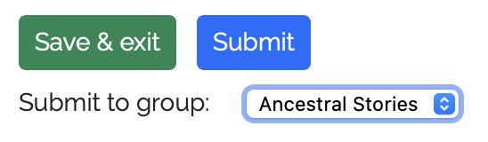
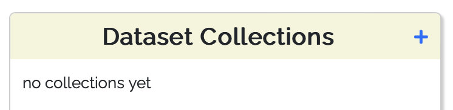

# Publishing in the WHG

## Create and publish a Place Collection

Place Collections in the WHG are annotated sets of place records from published datasets. Places can be added to a
collection in three ways:

1. From a Place Portal page, using the "Add to Collection" button.
2. One or more from a published dataset's Browse page, using the "Add to Collection" button.

3. By adding all of the places in one of your datasets — usually a small one created for the purpose.

Once places have been added, they can be annotated in the following way:

* Create a set of "annotation keywords" for the collection — a custom vocabulary used to classify each place's relation
  to the collection theme and to style map markers

* For each place, choose a relation keyword, and a note and optional date(s) and image — then save.
* If desired, drag and drop place "cards" to order them in a sequence

At any time, add the following elements to the collection as a whole:

* A title and description
* Collection keywords (these are distinct from annotation keywords)
* An image
* Upload an explanatory essay as a PDF file
* Up to three links to external web pages or resources

Choose visualization options to control how temporal information will appear in the collection's map and table
displays (you can preview how your collection will display at any time). Options include:

* Sort by sequence, start date, or end date?
* Include animated "ant trail" lines between places?
* Display a time "slider" filter or a sequence "player" control?

If you have joined a collection group class or workshop, you have the option to submit it to the instructor or workshop
leader for review. If the group has a gallery, once reviewed, the collection will appear there. Instructors have the
option to nominate exceptional collections for the WHG Student Gallery.

If your collection is not associated with a class or workshop, you can request it be published in the site-wide [WHG
gallery](https://whgazetteer.org/datasets/gallery/) using the site contact form.

## Create and publish a Dataset Collection

A WHG Dataset Collection is a set of published, indexed datasets in WHG, whose place records have been linked with
others for the same place where they occur. Its potential purposes and possibilities are outlined in the [Multiple
datasets](publishing.md#create-and-publish-a-dataset-collection) pathway section of this documentation.

All datasets in a Dataset Collection must be published and fully accessioned — that is, indexed in the WHG union index.
This is because the linking of records for the same place from multiple datasets occurs during the final indexing step.
See "Accessioning to the WHG union index" in the [Individual datasets](reconciliation.md#reviewing-accessioning-results) section.

The steps in creating a Dataset Collection are as follows:

1. Click the + in that section of your My Data dashboard, then fill in the three required fields on the Create Dataset
   Collection form.

2. On the "Add and manage datasets" tab of Dataset Collection Builder screen that follows, you can begin adding
   datasets. The dropdown menu lists accessioned datasets that you own are are a designated collaborator on.
3. You can add collaborators on the Collaborators tab. Co-owners are able to add datasets, and datasets they own will
   appear in the dropdown list of eligible datasets.
4. You can preview the still private presentation of the collection at any time by clicking the "view" icon in the upper
   right.

5. Each Dataset Collection should have an accompanying essay and image prior to publication. You can also add up to
   three links to related external web resources.
6. If a significant proportion of the collection's records have meaningful date information, turn on the "Display
   temporal information" switch. This will ensure the collection table has start and end columns, and that there is a
   time "slider" filter overlay on the map.
7. When you are ready to publish, click the "Request publication" button. This will notify WHG editorial staff that the
   collection is ready for review and publication. The timing of publication is up to its creators. Typically, datasets
   will be added over time, and it is sensible to publish the collection early, especially if it is a goal to attract
   addition datasets and collaborators.