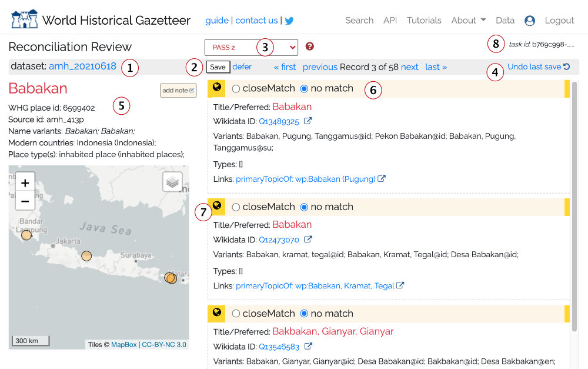
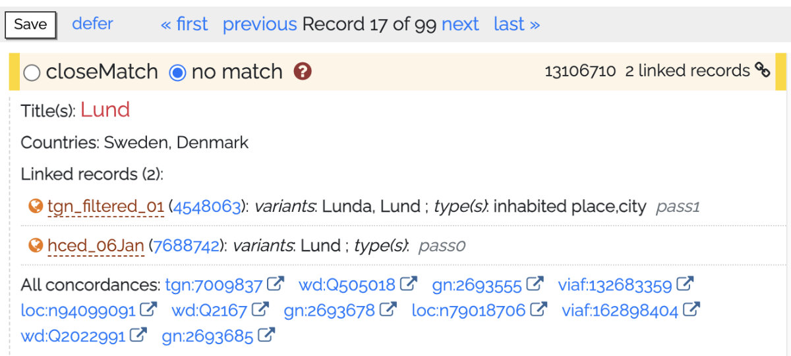

# Reconciliation & Accessioning

After a reconciliation task is run, the prospective matches to your records are presented for review. For each of your
records that had one or more "hits," those hit records from Wikidata and/or GeoNames are presented in a list on the
right of the screen, with your record on the left. The dataset owner and any designated collaborators decide, for each
of its records, whether one or more of the hits is a "close match." Clicking the save button records those closeMatch/no
match decisions and advances to the next record from the dataset. It is also possible to defer a decision, and placed in
a separate queue that can be revisited, possibly by someone with more relevant expertise. It is also possible to add a
note to the record for future reference.

The information displayed and options offered are explained below.

1. The user-designated label of the current dataset
2. Save / defer: After making match decisions (closeMatch or no match), click the Save button, If you want to defer a
   decision on this record, click 'defer' and it will go in a 'deferred' queue where it can be revisited. Optionally,
   add a note to help with the decision.
3. The current "PASS." If any automatic matches were made based on shared links, a PASS 0 is included, and these can be
   accepted en masse from the Linking screen. Otherwise, you will be stepped through potential matches from PASS 1 and
   then PASS 2, and in the case of Getty TGN, possibly PASS 3.
4. It is possible to undo the last Save action; sometimes we click, then think better of it.
5. The record from your dataset, as sent for matching. If it had associated geometry those will appear as green markers.
6. Close match vs. no match. This is explained in depth in its own section below
7. The globe icon indicates the potential match includes geometry. Hovering the mouse over the link will highlight it on
   the map.

## What does closeMatch mean?

The meaning of _closeMatch_ derives from the Simple Knowledge Organization
System ([SKOS](https://www.w3.org/TR/2009/REC-skos-reference-20090818/)) vocabulary, a widely used data
model. Practically speaking, for WHG asserting a `closeMatch` serves as a linking "glue." Specifically, records that
share one or more common linked asserted as `closeMatch` are joined/linked in our "union index" and returned together in
response to queries. For example, records for Abyssinia and Ethiopia share two `closeMatch` links, to a DBPedia record
and
a TGN record. Therefore, they appear together when searching for either Abyssinia or Ethiopia. We have determined there
is not a clear enough distinction with SKOS:exactMatch to offer that choice.

From the SKOS specification:

* _closeMatch_: "...(the) two concepts are sufficiently similar that they can be used interchangeably in some
  information
  retrieval applications"
* _exactMatch_: "...a high degree of confidence that two concepts can be used interchangeably across a wide range of
  information retrieval applications."

Furthermore, `closeMatch` is a super-property of `exactMatch`; that is, every `exactMatch` is also a `closeMatch`.
Remember, the purpose of the assertion is to ensure records that should intuitively appear together, do.

# Reviewing accessioning results

Review of results for accessioning to the WHG index is similar
to review for reconciliation but differs in the following
ways:

1. Instead of matching to individual records from Wikidata or GeoNames, you are deciding on matches to sets of records
   in the WHG union index — records that have been previously linked to each other. If you decide to match to a set,
   your record will be added to that set; in this case adding a third attestation for Lund.

2. If you decide there is no match and proceed, your record is indexed as a new first, or "seed", for the place.
3. When the accessioning task was run, all of your records that had no prospective matches were automatically indexed as
   new first ("seed") records for those places.