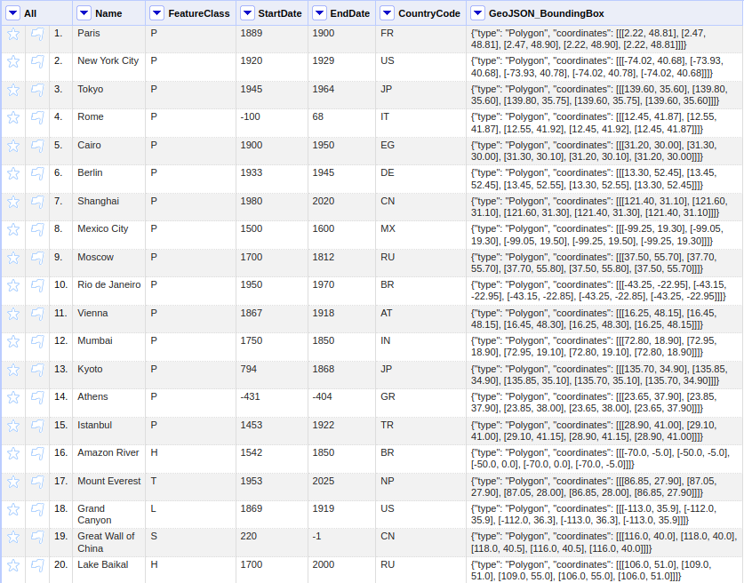
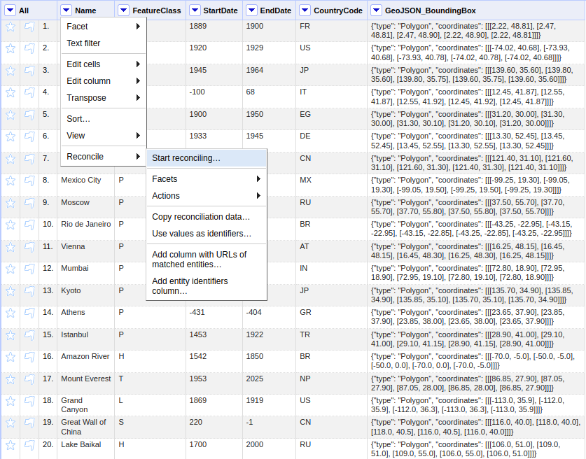
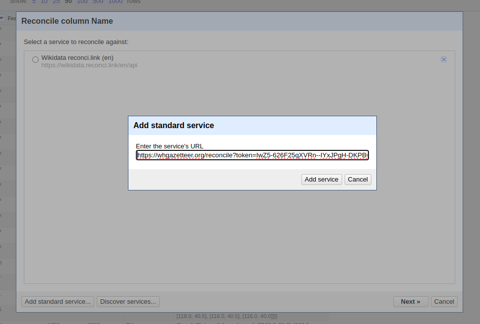
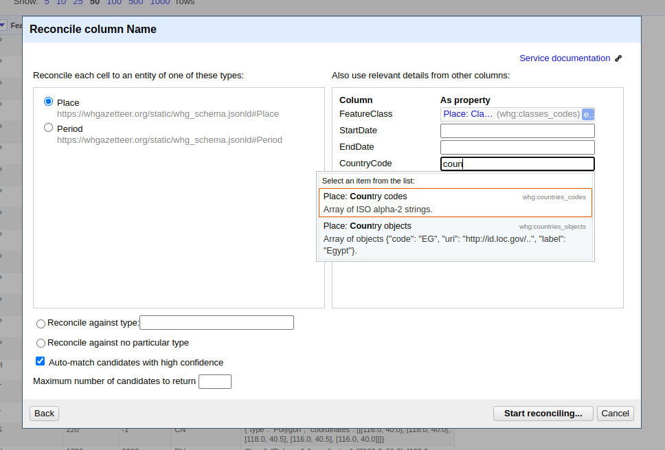
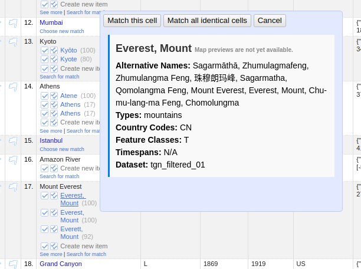
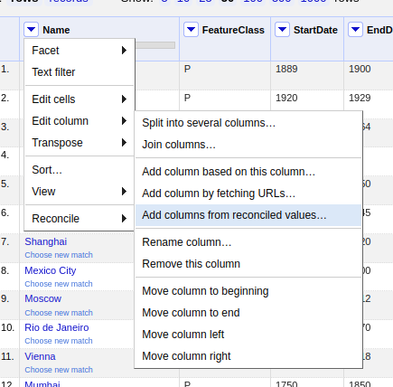
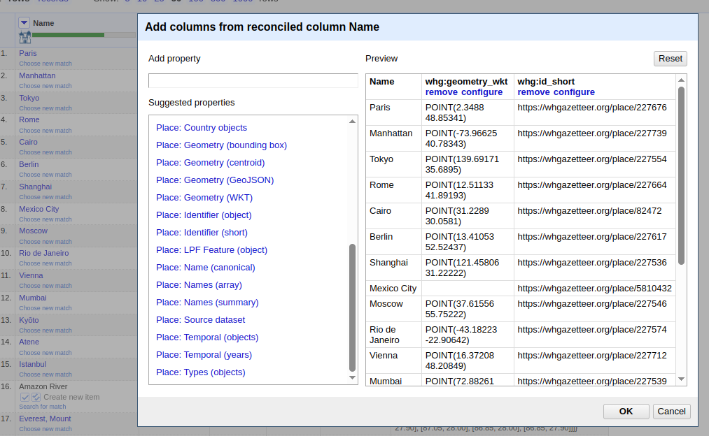
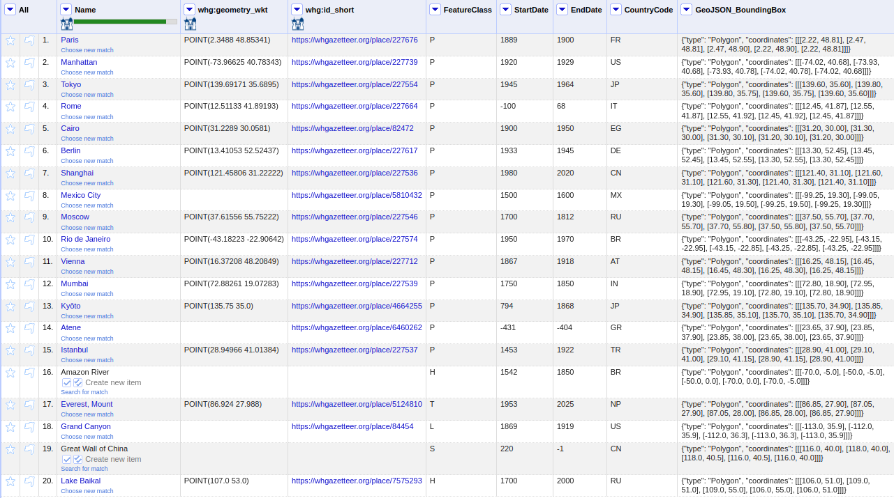
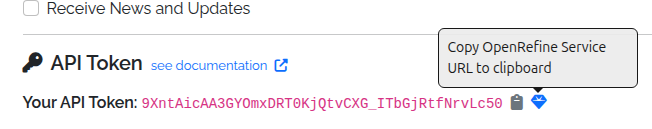

# Application Programming Interfaces (APIs)

> ⚠️ **Tokens are required for access to most WHG API endpoints** (see [below](#api-tokens)).
>
> Full, interactive API documentation is available
> at [https://whgazetteer.org/api/schema/swagger-ui/](https://whgazetteer.org/api/schema/swagger-ui/)
>

The World Historical Gazetteer (WHG) provides two complementary APIs:

## Entity API

- Access canonical representations of our entities: **Places**, **Datasets**, **Collections**, **Areas**, and *
  *[PeriodO](https://perio.do/) Periods**.
- Retrieve full metadata, names, types, geometries, temporal bounds, authority info, and linked resources.
- Machine-readable feature endpoints support Linked Places Format (LPF) for GIS and reconciliation tools.

### Persistent Identifiers (w3id.org)

WHG entities now have permanent identifiers under the `https://w3id.org/whg/` namespace. These identifiers resolve via
HTTP 303 redirects to the WHG Entity API and are intended to be stable, citable URIs.

**Canonical identifier pattern**

- Base: `https://w3id.org/whg/`
- Entity: `https://w3id.org/whg/id/{id}` -> `https://whgazetteer.org/entity/{id}/api` (303 redirect)

**Content negotiation for the base namespace**

- If `Accept: application/json` or `application/ld+json`, redirect (303) to `https://whgazetteer.org/api/schema/`.
- If `Accept: text/html` or `application/xhtml+xml`, redirect (303) to `https://whgazetteer.org/`.
- Otherwise, return HTTP 404.

**Examples by entity type**

- Place: `https://w3id.org/whg/id/place:169687`
- Dataset: `https://w3id.org/whg/id/dataset:1234`
- Collection: `https://w3id.org/whg/id/collection:5678`
- Area: `https://w3id.org/whg/id/area:9012`
- PeriodO period: `https://w3id.org/whg/id/period:3456`

>**Note on DOIs for Published Datasets and Collections**
>
>Upon publication, **Datasets** and **Collections** are also assigned DOIs. WHG DOIs use the prefix `10.83427` and
follow a hyphenated pattern (for example, `10.60681/whg-dataset-1234`), which differs from the colon-separated
w3id.org identifiers. WHG DOIs are provided through [DataCite](https://datacite.org/) with support from the University of Pittsburgh Library System.

### Namespace Prefix (prefix.cc)

The `whg:` namespace prefix is registered at `http://prefix.cc/whg` and expands to
`https://w3id.org/whg/id/`. This is useful for compact identifiers in JSON-LD and JSON Schema contexts.

**Example usage in a JSON Schema with JSON-LD context**

```json
{
  "$schema": "https://json-schema.org/draft/2020-12/schema",
  "$id": "https://w3id.org/whg/schema/place.json",
  "@context": {
    "whg": "https://w3id.org/whg/id/"
  },
  "title": "WHG Place Reference",
  "type": "object",
  "properties": {
    "id": {
      "type": "string",
      "format": "iri",
      "examples": ["whg:place:169687"]
    }
  },
  "required": ["id"]
}
```

## Reconciliation Service API

- Compatible with [OpenRefine](https://openrefine.org/).
- Supports both Place and [PeriodO](https://perio.do/) suggestions, batch reconciliation, and property enrichment.
- **Data Extension** is supported, allowing users to enrich their tables with properties like **Geometry**, *
  *Alternative Names**, **Temporal Range**, and **Country Codes** after reconciliation.

### Using the WHG Reconciliation API in OpenRefine

The WHG Reconciliation Service allows you to match place names in your spreadsheet data against WHG's comprehensive
collection of historical places. This is particularly useful for disambiguating place names and enriching your data with
standardised identifiers, coordinates, and temporal information.

#### Prerequisites

1. Install [OpenRefine](https://openrefine.org/download) (version 3.0 or later recommended)
2. Have a dataset with place name columns that you want to reconcile
3. Obtain your WHG API token from your Profile page at whgazetteer.org

#### Step 1: Adding the WHG Reconciliation Service

1. Open your project in OpenRefine


2. Click on the selector button in the column header containing place names, and select **Reconcile** → **Start reconciling...**


3. In the reconciliation dialog, click **Add Standard Service** (bottom left)
4. Enter your personalized reconciliation service URL from your WHG Profile page (see [below](#api-tokens))


5. Click **Add Service**

The WHG reconciliation service should now appear in the list of available services.

#### Step 2: Configuring Reconciliation Parameters

After selecting the WHG service, you can configure various parameters to improve matching accuracy:

- **Reconcile each cell to**: Select "Place" (the default entity type)
- **Optional: Also use relevant details from other columns**: Check boxes for any columns containing additional context (e.g.,
  country names, dates, coordinates)


#### Step 3: Running Reconciliation

1. Click **Start Reconciling**
2. OpenRefine will send your place names to the WHG API in batches
3. Results will appear in your column with confidence scores

#### Step 4: Reviewing and Confirming Matches

1. Click on cells showing multiple candidates
2. Review the suggested matches in the popup dialog


3. Select the correct match or choose "Create new item" if none match
4. Use **Reconcile** → **Actions** → **Match each cell to its best candidate** for bulk acceptance (use carefully!)

#### Step 5: Data Extension (Enrichment)

After reconciliation, you can add properties from WHG to your dataset:

1. Click the reconciled column header
2. Select **Edit column** → **Add columns from reconciled values...**


3. Choose properties to add


4. Click **OK** to add the new columns


#### Tips for Better Results

- **Pre-process your data**: Clean up obvious typos and normalise formatting
- **Use temporal filters**: Historical place names are often ambiguous without temporal context
- **Leverage additional columns**: Include date ranges, broader geographic context, or place types in separate columns
  and reference them during reconciliation
- **Start with a sample**: Test reconciliation on a small subset before processing large datasets
- **Review auto-matches**: Even high-confidence matches should be spot-checked, especially for common place names

#### Batch Reconciliation via API

For programmatic access or very large datasets, you can use the WHG Reconciliation API directly. See
the [full API documentation](https://whgazetteer.org/api/schema/swagger-ui/) for details on query structure and response
formats.

## API Tokens

Registered users can generate an API token from their Profile page.
Alongside the token, the Profile page also provides a preconfigured [OpenRefine](https://openrefine.org/) reconciliation
service URL, which can be copied and pasted into OpenRefine's reconciliation dialog,
under "Add Standard Service".



### Using an API Token

The simplest way to use an API token is to include it as a query parameter in the request URL. For example:

```bash
https://whgazetteer.org/reconcile/?token=<token>
```

Otherwise, it may be included in the `Authorization` header, using the `Bearer` schema. Requests **must** also include a
suitable
`User-Agent` to avoid bot-filters. For example:

```bash
curl -X POST https://whgazetteer.org/reconcile/ \
  -H "Content-Type: application/json" \
  -H "Authorization: Bearer <token>" \
  -H "User-Agent: notbot" \
  -d '{
    "queries": {
      "q1": {
        "query": "London",
        "mode": "fuzzy",
        "fclasses": ["A","P"],
        "start": 1200,
        "end": 2050,
        "undated": true,
        "countries": ["GB","US"],
        "bounds": {
          "geometries": [{
            "type": "Polygon",
            "coordinates": [[
              [-1.0,51.0],
              [-1.0,52.0],
              [0.5,52.0],
              [0.5,51.0],
              [-1.0,51.0]
            ]]
          }]
        }
      }
    }
  }'
```
