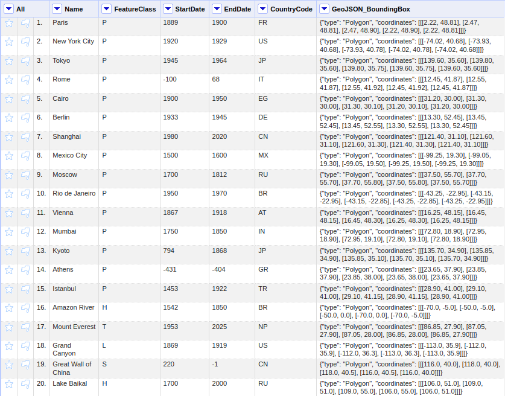
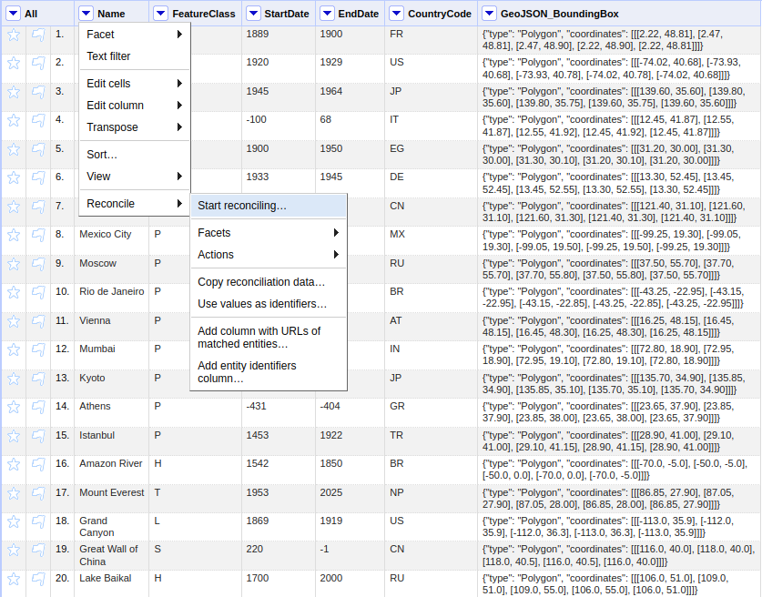
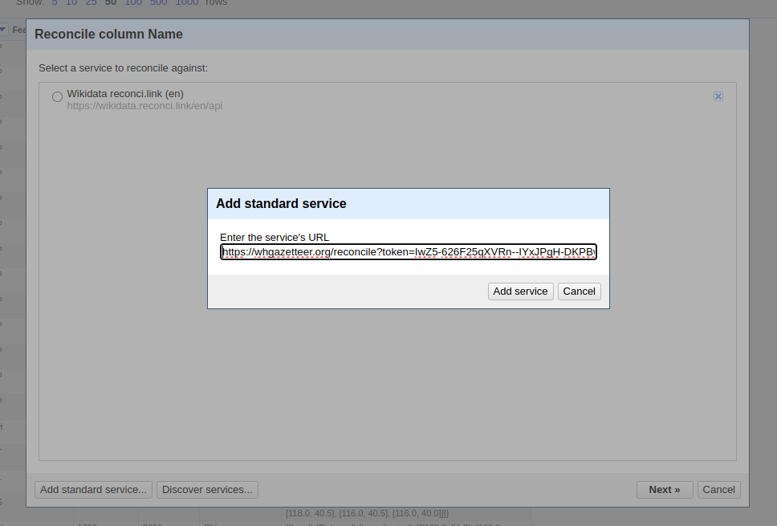
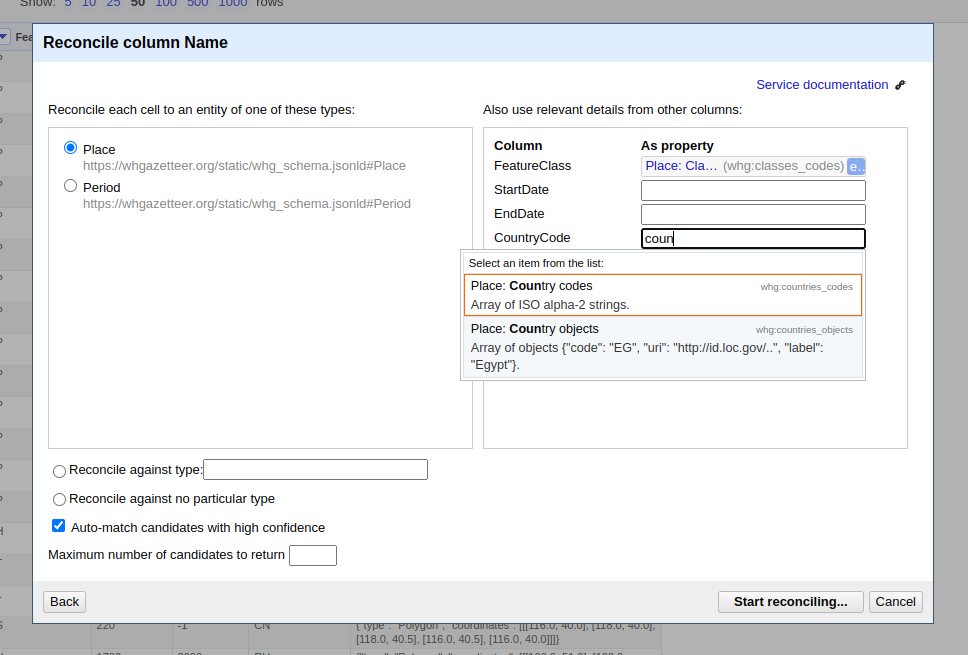
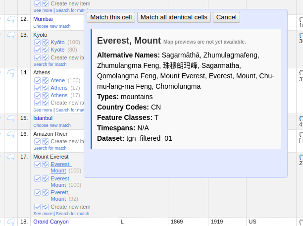
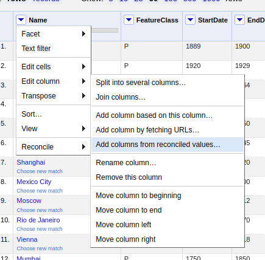
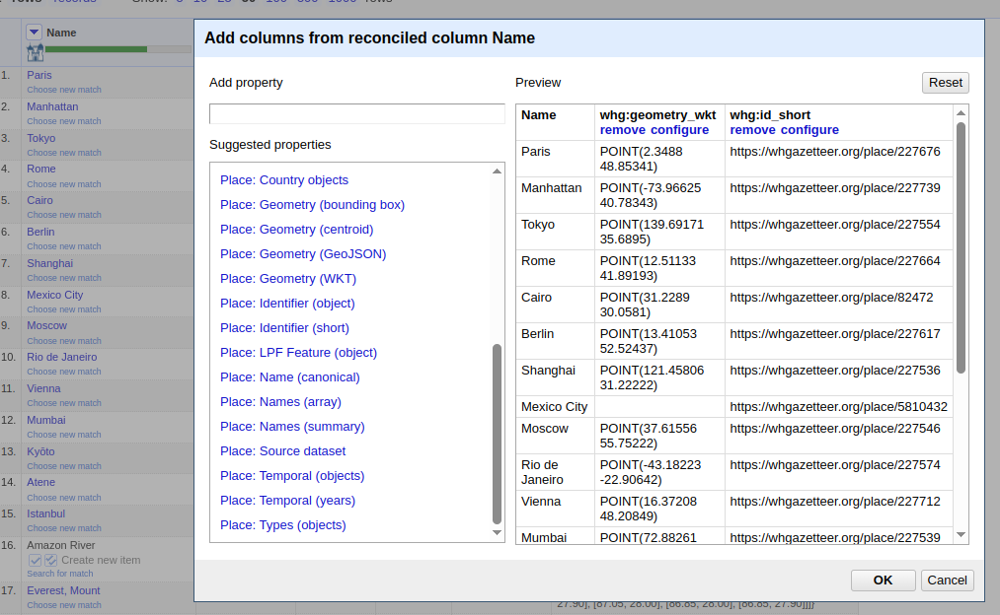
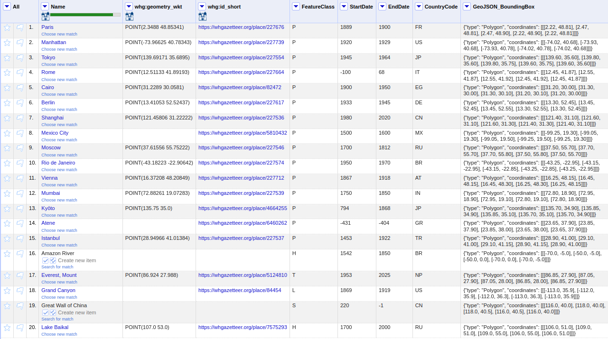
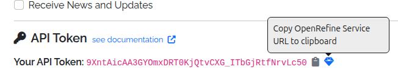

# Application Programming Interfaces (APIs)

> ⚠️ **Tokens are required for access to most WHG API endpoints** (see [below](#api-tokens)).
>
> Full, interactive API documentation is available
> at [https://whgazetteer.org/api/schema/swagger-ui/](https://whgazetteer.org/api/schema/swagger-ui/)
>

The World Historical Gazetteer (WHG) provides two complementary APIs:

## Entity API

- Access canonical representations of our entities: **Places**, **Datasets**, **Collections**, **Areas**, and **[PeriodO](https://perio.do/) Periods**.
- Retrieve full metadata, names, types, geometries, temporal bounds, authority info, and linked resources.
- Machine-readable feature endpoints return valid **Linked Places Format (LPF) v1.1** for GIS and reconciliation tools.

### Entity Endpoints

| Endpoint | Method | Description |
|---|---|---|
| `/entity/{type}:{id}/` | GET | Human-readable detail page (redirects to web app) |
| `/entity/{type}:{id}/api` | GET | Machine-readable LPF feature (JSON) |
| `/entity/{type}:{id}/preview` | GET | HTML preview snippet |

Valid entity types: `place`, `dataset`, `collection`, `area`, `period`.

### Place Identifiers and Source Namespaces

Place identifiers include a **namespace prefix** that indicates the originating source. For example:

- `place:169687` — a WHG place (no prefix, or equivalently `whg`)
- `place:gn:745044` — a GeoNames place
- `place:tgn:7010731` — a Getty TGN place

All places are returned in **Linked Places Format (LPF) v1.1** from the `/api` endpoint, regardless of source, with a standard structure including `@context`, `type: "Feature"`, `@id`, `geometry`, `names`, `types`, `links`, and `when`.

You can use the `namespaces` parameter on Reconciliation and Suggest endpoints to restrict which sources are searched (see [Source Namespaces](#source-namespaces)).

**Example: Fetching a GeoNames place**

```bash
curl "https://whgazetteer.org/entity/place:gn:745044/api?token=<token>"
```

```json
{
  "@context": "https://raw.githubusercontent.com/LinkedPasts/linked-places/master/linkedplaces-context-v1.1.jsonld",
  "type": "Feature",
  "@id": "https://whgazetteer.org/entity/place:gn:745044/api",
  "properties": {
    "title": "İstanbul",
    "ccodes": ["TR"],
    "source_id": "gn:745044"
  },
  "geometry": {
    "type": "Point",
    "coordinates": [28.94966, 41.01384]
  },
  "names": [
    {"toponym": "Constantinople", "lang": "en"},
    {"toponym": "Byzantium", "lang": "en"},
    {"toponym": "İstanbul", "lang": "tr"}
  ],
  "types": [{"identifier": "PPLA", "label": "P", "sourceLabel": "P.PPLA"}],
  "links": [],
  "when": {}
}
```

**Example: Fetching a WHG place**

```bash
curl "https://whgazetteer.org/entity/place:169687/api?token=<token>"
```

```json
{
  "@context": "https://raw.githubusercontent.com/LinkedPasts/linked-places/master/linkedplaces-context-v1.1.jsonld",
  "type": "Feature",
  "@id": "https://whgazetteer.org/entity/place:169687/api",
  "properties": {
    "title": "London",
    "ccodes": ["GB"],
    "fclasses": ["P"],
    "dataset": "Getty TGN (partial)",
    "src_id": "7011781"
  },
  "geometry": {"type": "Point", "coordinates": [-0.1275, 51.50722]},
  "names": [{"toponym": "London", "citations": [{"id": "...", "label": "Getty TGN"}]}],
  "types": [{"label": "inhabited places", "identifier": "aat:300008347"}],
  "links": [{"type": "closeMatch", "identifier": "tgn:7011781"}],
  "when": {"timespans": [{"start": {"earliest": "43"}, "end": {"latest": ""}}]}
}
```

### Persistent Identifiers (w3id.org)

WHG entities now have permanent identifiers under the `https://w3id.org/whg/` namespace. These identifiers resolve via
HTTP 303 redirects to the WHG Entity API and are intended to be stable, citable URIs.

**Canonical identifier pattern**

- Base: `https://w3id.org/whg/`
- Entity: `https://w3id.org/whg/id/{id}` → `https://whgazetteer.org/entity/{id}/api` (303 redirect)

**Content negotiation for the base namespace**

- If `Accept: application/json` or `application/ld+json`, redirect (303) to `https://whgazetteer.org/api/schema/`.
- If `Accept: text/html` or `application/xhtml+xml`, redirect (303) to `https://whgazetteer.org/`.
- Otherwise, return HTTP 404.

**Examples by entity type**

- Place (WHG): `https://w3id.org/whg/id/place:169687`
- Place (GeoNames): `https://w3id.org/whg/id/place:gn:745044`
- Dataset: `https://w3id.org/whg/id/dataset:1234`
- Collection: `https://w3id.org/whg/id/collection:5678`
- Area: `https://w3id.org/whg/id/area:9012`
- PeriodO period: `https://w3id.org/whg/id/period:3456`

>**Note on DOIs for Published Datasets and Collections**
>
>Upon publication, **Datasets** and **Collections** are also assigned DOIs. WHG DOIs use the prefix `10.83427` and
follow a hyphenated pattern (for example, `10.60681/whg-dataset-1234`), which differs from the colon-separated
w3id.org identifiers. WHG DOIs are provided through [DataCite](https://datacite.org/) with support from the University of Pittsburgh Library System.

### Namespace Prefix (prefix.cc)

The `whg:` namespace prefix is registered at `http://prefix.cc/whg` and expands to
`https://w3id.org/whg/id/`. This is useful for compact identifiers in JSON-LD and JSON Schema contexts.

**Example usage in a JSON Schema with JSON-LD context**

```json
{
  "$schema": "https://json-schema.org/draft/2020-12/schema",
  "$id": "https://w3id.org/whg/schema/place.json",
  "@context": {
    "whg": "https://w3id.org/whg/id/"
  },
  "title": "WHG Place Reference",
  "type": "object",
  "properties": {
    "id": {
      "type": "string",
      "format": "iri",
      "examples": ["whg:place:169687"]
    }
  },
  "required": ["id"]
}
```

## Reconciliation Service API

- Compatible with [OpenRefine](https://openrefine.org/) and implements the [Reconciliation Service API v0.2](https://reconciliation-api.github.io/specs/0.2/).
- Supports both **Place** and **[PeriodO](https://perio.do/) Period** suggestions, batch reconciliation, and property enrichment.
- Searches across **multiple source indices** simultaneously (WHG, GeoNames, Getty TGN, and others).
- Results can be **filtered** by source namespace, country code, GeoNames feature class, and AAT place type.
- **Data Extension** is supported, allowing users to enrich their tables with properties like **Geometry**, **Alternative Names**, **Temporal Range**, and **Country Codes** after reconciliation.

### Reconciliation Endpoints

| Endpoint | Method | Description |
|---|---|---|
| `/reconcile` | GET | Service metadata manifest |
| `/reconcile` | POST | Batch reconciliation queries or data extension |
| `/reconcile/properties` | GET | Discover extensible properties |
| `/suggest/entity` | GET | Typeahead entity suggestions by prefix |
| `/suggest/property` | GET | Typeahead property suggestions by prefix |

### Query Parameters

The following parameters can be included in each query object within a reconciliation request, or as query-string parameters for the suggest endpoint.

#### Text Search

| Parameter | Type | Description |
|---|---|---|
| `query` | string | Free-text search string. Required. |
| `mode` | string | Search mode: `exact`, `fuzzy` (default), `starts`, or `in`. Fuzzy mode can also be specified as `prefix_length\|fuzziness` (e.g. `2\|1`). |

#### Facet Filtering

| Parameter | Type | Reconcile | Suggest | Description |
|---|---|---|---|---|
| `countries` | array or string | ✅ | ✅ | ISO 3166-1 alpha-2 country codes. Format: `["US","GB"]` or `"US,GB"`. |
| `fclasses` | array or string | ✅ | ✅ | GeoNames feature classes: `A` (Administrative), `H` (Hydrographic), `L` (Landscape), `P` (Populated places), `R` (Roads/routes), `S` (Sites), `T` (Topographic). |
| `types` | array or string | ✅ | ✅ | AAT place type identifiers (e.g. `"aat:300008347"`). Matched against the `types.identifier` field. |
| `namespaces` | string | ✅ | ✅ | Comma-separated source namespace codes. `whg` = WHG, `gn` = GeoNames, `tgn` = Getty TGN. Omit for all sources. |

#### Temporal Filtering

| Parameter | Type | Description |
|---|---|---|
| `start` | integer | Start year for temporal filtering. |
| `end` | integer | End year (default: current year). Must be ≥ `start`. |
| `undated` | boolean | Include results with no temporal metadata (default: true). |

#### Spatial Filtering

| Parameter | Type | Description |
|---|---|---|
| `bounds` | object | GeoJSON geometry for spatial restriction. |
| `lat`, `lng`, `radius` | float | Circular search: latitude (-90–90), longitude (-180–180), radius in km. All three required together. |
| `userareas` | array | IDs of user-defined stored areas. |

#### Other

| Parameter | Type | Description |
|---|---|---|
| `dataset` | integer | Restrict to a specific dataset ID. |
| `unlocated` | boolean | Include results with no spatial metadata (default: true). |
| `size` | integer | Maximum results per query (default: 100, max: 1000). |

### Source Namespaces

WHG searches across multiple place indices. Each source is identified by a **namespace prefix**:

| Namespace | Source | ID Example |
|---|---|---|
| `whg` | WHG places | `place:169687` |
| `gn` | GeoNames | `place:gn:745044` |
| `tgn` | Getty TGN | `place:tgn:7010731` |

When `namespaces` is omitted, all available sources are searched. When specified, only the listed sources are queried — this can improve performance and relevance.

**Examples:**
- `"namespaces": "whg"` — search only WHG places
- `"namespaces": "gn,tgn"` — search GeoNames and Getty TGN
- `"namespaces": "whg,gn"` — search WHG and GeoNames

### Data Extension Properties

After reconciliation, you can enrich your data with these properties via the extend endpoint:

**Place properties:**

| Property ID | Description |
|---|---|
| `whg:names_canonical` | Preferred/canonical place name |
| `whg:names_summary` | List of all toponyms |
| `whg:names_array` | Names as structured objects |
| `whg:countries_codes` | ISO country codes |
| `whg:countries_objects` | Country objects with code and label |
| `whg:classes_codes` | GeoNames feature class codes |
| `whg:classes_objects` | Feature class objects with label and reference |
| `whg:types_objects` | AAT type objects |
| `whg:geometry_centroid` | Centroid as "lat, lng" string |
| `whg:geometry_geojson` | Full GeoJSON geometry |
| `whg:geometry_wkt` | Geometry as WKT string |
| `whg:geometry_bbox` | Bounding box |
| `whg:temporal_objects` | Temporal data as structured objects |
| `whg:temporal_years` | Temporal range as year values |
| `whg:dataset` | Source dataset name |
| `whg:id_short` | WHG entity URI |
| `whg:id_object` | Entity ID and label as object |
| `whg:lpf_feature` | Complete LPF feature |

**Period properties:**

| Property ID | Description |
|---|---|
| `whg:chrononym_canonical` | Canonical period label |
| `whg:chrononym_variants_array` | Variant labels as objects |
| `whg:chrononym_variants_summary` | Variant labels as strings |
| `whg:periodo_identifier` | PeriodO identifier |
| `whg:period_authority_object` | Authority information |
| `whg:temporal_bounds_objects` | Temporal bounds as objects |
| `whg:temporal_bounds_years` | Temporal bounds as years |
| `whg:spatial_coverage_geometry` | Spatial coverage geometry |
| `whg:spatial_coverage_objects` | Spatial coverage objects |

### Using the WHG Reconciliation API in OpenRefine

The WHG Reconciliation Service allows you to match place names in your spreadsheet data against WHG's comprehensive
collection of historical places. This is particularly useful for disambiguating place names and enriching your data with
standardised identifiers, coordinates, and temporal information.

#### Prerequisites

1. Install [OpenRefine](https://openrefine.org/download) (version 3.0 or later recommended)
2. Have a dataset with place name columns that you want to reconcile
3. Obtain your WHG API token from your Profile page at whgazetteer.org

#### Step 1: Adding the WHG Reconciliation Service

1. Open your project in OpenRefine


2. Click on the selector button in the column header containing place names, and select **Reconcile** → **Start reconciling...**


3. In the reconciliation dialog, click **Add Standard Service** (bottom left)
4. Enter your personalized reconciliation service URL from your WHG Profile page (see [below](#api-tokens))


5. Click **Add Service**

The WHG reconciliation service should now appear in the list of available services.

#### Step 2: Configuring Reconciliation Parameters

After selecting the WHG service, you can configure various parameters to improve matching accuracy:

- **Reconcile each cell to**: Select "Place" (the default entity type)
- **Optional: Also use relevant details from other columns**: Check boxes for any columns containing additional context (e.g.,
  country names, dates, coordinates)


#### Step 3: Running Reconciliation

1. Click **Start Reconciling**
2. OpenRefine will send your place names to the WHG API in batches
3. Results will appear in your column with confidence scores
4. Results may include places from multiple sources (WHG, GeoNames, TGN) — the source namespace is encoded in the entity ID

#### Step 4: Reviewing and Confirming Matches

1. Click on cells showing multiple candidates
2. Review the suggested matches in the popup dialog


3. Select the correct match or choose "Create new item" if none match
4. Use **Reconcile** → **Actions** → **Match each cell to its best candidate** for bulk acceptance (use carefully!)

#### Step 5: Data Extension (Enrichment)

After reconciliation, you can add properties from WHG to your dataset:

1. Click the reconciled column header
2. Select **Edit column** → **Add columns from reconciled values...**


3. Choose properties to add (see [Data Extension Properties](#data-extension-properties) for the full list)


4. Click **OK** to add the new columns


> **Note:** Data extension works for places from all sources. For some sources, certain properties
> (e.g. `whg:geometry_wkt`, `whg:temporal_objects`) may return empty values if the source data does not include them.

#### Tips for Better Results

- **Pre-process your data**: Clean up obvious typos and normalise formatting
- **Use temporal filters**: Historical place names are often ambiguous without temporal context
- **Leverage additional columns**: Include date ranges, broader geographic context, or place types in separate columns
  and reference them during reconciliation
- **Filter by namespace**: If you know your places are in a specific source (e.g. GeoNames), use `namespaces` to restrict the search for faster, more relevant results
- **Filter by country or feature class**: Use `countries` and `fclasses` to narrow results for common place names
- **Start with a sample**: Test reconciliation on a small subset before processing large datasets
- **Review auto-matches**: Even high-confidence matches should be spot-checked, especially for common place names

#### Batch Reconciliation via API

For programmatic access or very large datasets, you can use the WHG Reconciliation API directly. See
the [full API documentation](https://whgazetteer.org/api/schema/swagger-ui/) for details on query structure and response
formats.

## API Tokens

Registered users can generate an API token from their Profile page.
Alongside the token, the Profile page also provides a preconfigured [OpenRefine](https://openrefine.org/) reconciliation
service URL, which can be copied and pasted into OpenRefine's reconciliation dialog,
under "Add Standard Service".



### Using an API Token

The simplest way to use an API token is to include it as a query parameter in the request URL. For example:

```bash
https://whgazetteer.org/reconcile/?token=<token>
```

Otherwise, it may be included in the `Authorization` header, using the `Bearer` schema. Requests **must** also include a
suitable
`User-Agent` to avoid bot-filters. For example:

```bash
curl -X POST https://whgazetteer.org/reconcile/ \
  -H "Content-Type: application/json" \
  -H "Authorization: Bearer <token>" \
  -H "User-Agent: notbot" \
  -d '{
    "queries": {
      "q1": {
        "query": "London",
        "mode": "fuzzy",
        "fclasses": ["A","P"],
        "start": 1200,
        "end": 2050,
        "undated": true,
        "countries": ["GB","US"],
        "namespaces": "whg",
        "bounds": {
          "geometries": [{
            "type": "Polygon",
            "coordinates": [[
              [-1.0,51.0],
              [-1.0,52.0],
              [0.5,52.0],
              [0.5,51.0],
              [-1.0,51.0]
            ]]
          }]
        }
      }
    }
  }'
```

### Suggest Endpoint Example

```bash
curl "https://whgazetteer.org/suggest/entity?prefix=Edin&limit=5&countries=GB&fclasses=P&namespaces=whg&token=<token>"
```

### Entity API Example

```bash
# Fetch a GeoNames place as LPF
curl "https://whgazetteer.org/entity/place:gn:745044/api?token=<token>"

# Fetch a WHG place as LPF
curl "https://whgazetteer.org/entity/place:169687/api?token=<token>"

# Preview HTML snippet for a place
curl "https://whgazetteer.org/entity/place:gn:745044/preview?token=<token>"
```
