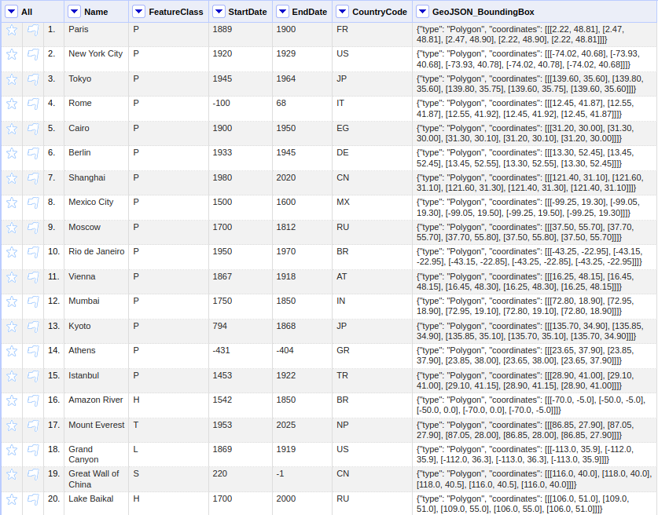
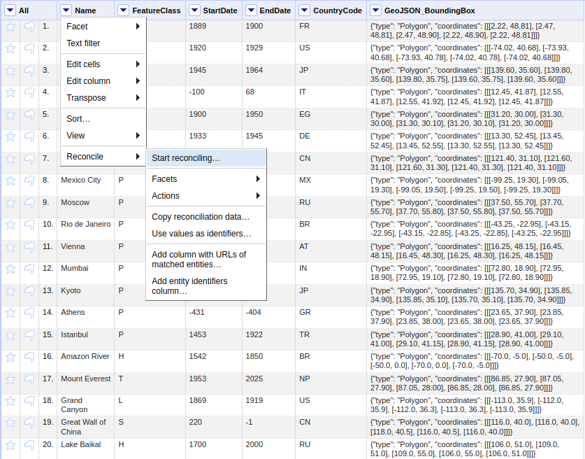
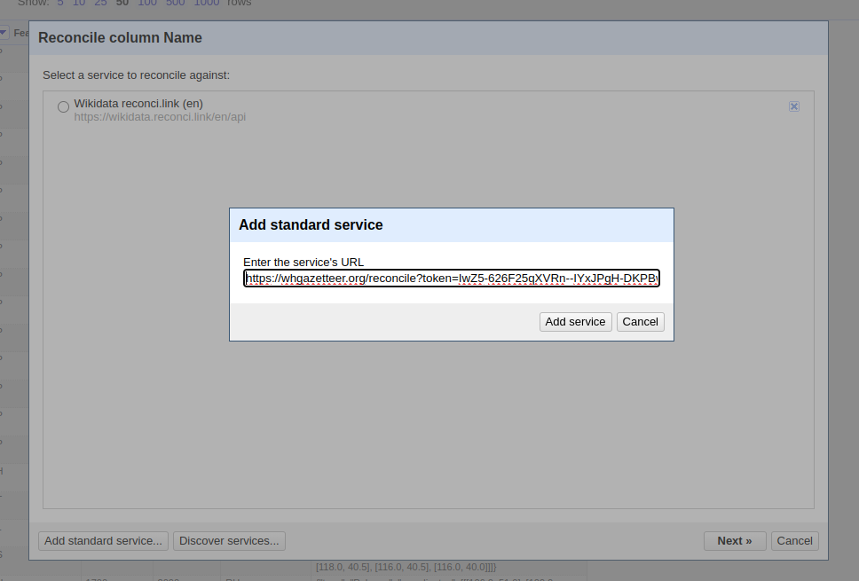
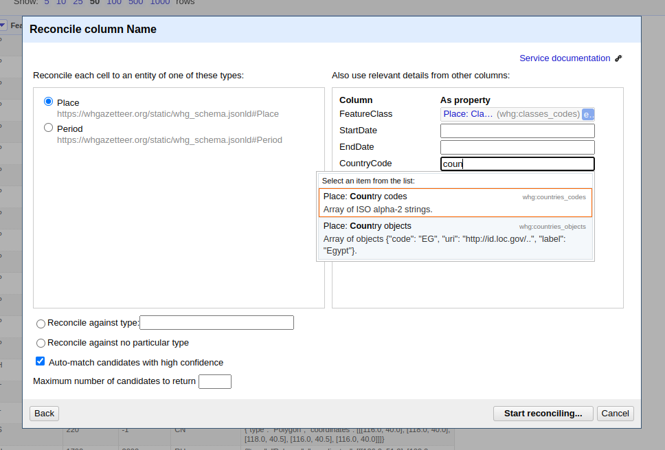
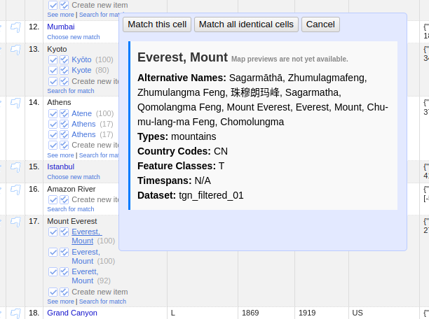
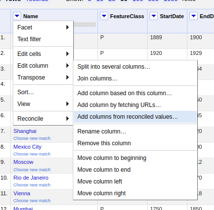
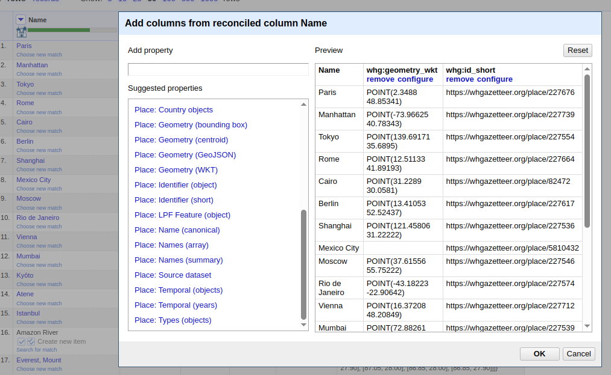
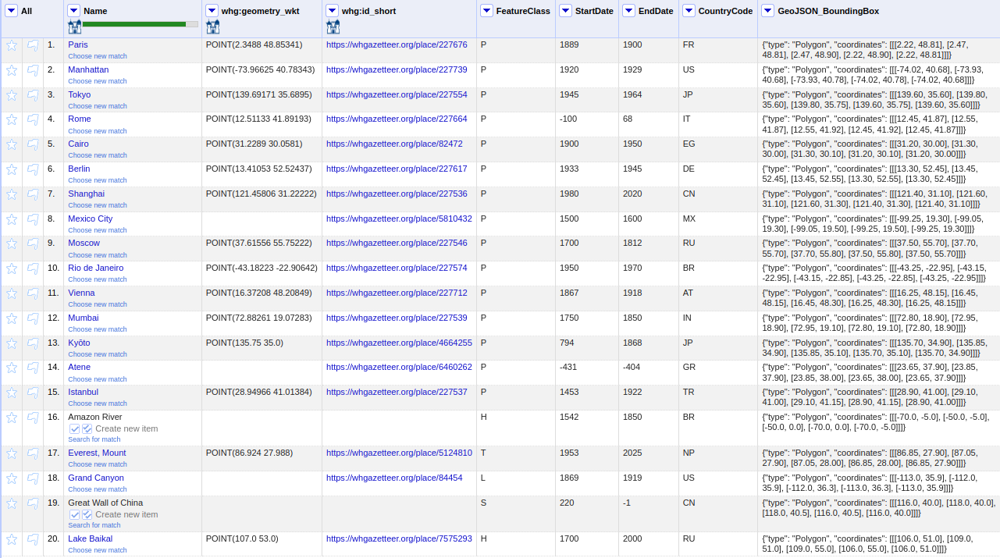
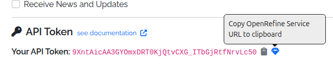

# Application Programming Interfaces (APIs)

> ⚠️ **Tokens are required for access to most WHG API endpoints** (see [below](#api-tokens)).
>
> Full, interactive API documentation is available
> at [https://whgazetteer.org/api/schema/swagger-ui/](https://whgazetteer.org/api/schema/swagger-ui/)
>

The World Historical Gazetteer (WHG) provides two complementary APIs:

## Entity API

- Access canonical representations of our entities: **Places**, **Datasets**, **Collections**, **Areas**, and **[PeriodO](https://perio.do/) Periods**.
- Retrieve full metadata, names, types, geometries, temporal bounds, authority info, and linked resources.
- Machine-readable feature endpoints return valid **Linked Places Format (LPF) v1.1** for GIS and reconciliation tools.

### Entity Endpoints

| Endpoint | Method | Description |
|---|---|---|
| `/entity/{type}:{id}/` | GET | Human-readable detail page (redirects to web app) |
| `/entity/{type}:{id}/api` | GET | Machine-readable LPF feature (JSON) |
| `/entity/{type}:{id}/preview` | GET | HTML preview snippet |

Valid entity types: `place`, `dataset`, `collection`, `area`, `period`.

### Place Identifiers and Source Namespaces

Place identifiers include a **namespace prefix** that indicates the originating source. For example:

- `place:169687` — a WHG place (no prefix, or equivalently `whg`)
- `place:gn:745044` — a GeoNames place
- `place:tgn:7010731` — a Getty TGN place

All places are returned in **Linked Places Format (LPF) v1.1** from the `/api` endpoint, regardless of source, with a standard structure including `@context`, `type: "Feature"`, `@id`, `geometry`, `names`, `types`, `links`, and `when`.

You can use the `namespaces` parameter on Reconciliation and Suggest endpoints to restrict which sources are searched (see [Source Namespaces](#source-namespaces)).

**Example: Fetching a GeoNames place**

```bash
curl "https://whgazetteer.org/entity/place:gn:745044/api?token=<token>"
```

```json
{
  "@context": "https://raw.githubusercontent.com/LinkedPasts/linked-places/master/linkedplaces-context-v1.1.jsonld",
  "type": "Feature",
  "@id": "https://whgazetteer.org/entity/place:gn:745044/api",
  "properties": {
    "title": "İstanbul",
    "ccodes": ["TR"],
    "source_id": "gn:745044"
  },
  "geometry": {
    "type": "Point",
    "coordinates": [28.94966, 41.01384]
  },
  "names": [
    {"toponym": "Constantinople", "lang": "en"},
    {"toponym": "Byzantium", "lang": "en"},
    {"toponym": "İstanbul", "lang": "tr"}
  ],
  "types": [{"identifier": "PPLA", "label": "P", "sourceLabel": "P.PPLA"}],
  "links": [],
  "when": {}
}
```

**Example: Fetching a WHG place**

```bash
curl "https://whgazetteer.org/entity/place:169687/api?token=<token>"
```

```json
{
  "@context": "https://raw.githubusercontent.com/LinkedPasts/linked-places/master/linkedplaces-context-v1.1.jsonld",
  "type": "Feature",
  "@id": "https://whgazetteer.org/entity/place:169687/api",
  "properties": {
    "title": "London",
    "ccodes": ["GB"],
    "fclasses": ["P"],
    "dataset": "Getty TGN (partial)",
    "src_id": "7011781"
  },
  "geometry": {"type": "Point", "coordinates": [-0.1275, 51.50722]},
  "names": [{"toponym": "London", "citations": [{"id": "...", "label": "Getty TGN"}]}],
  "types": [{"label": "inhabited places", "identifier": "aat:300008347"}],
  "links": [{"type": "closeMatch", "identifier": "tgn:7011781"}],
  "when": {"timespans": [{"start": {"earliest": "43"}, "end": {"latest": ""}}]}
}
```

### Persistent Identifiers (w3id.org)

WHG entities now have permanent identifiers under the `https://w3id.org/whg/` namespace. These identifiers resolve via
HTTP 303 redirects to the WHG Entity API and are intended to be stable, citable URIs.

**Canonical identifier pattern**

- Base: `https://w3id.org/whg/`
- Entity: `https://w3id.org/whg/id/{id}` → `https://whgazetteer.org/entity/{id}/api` (303 redirect)

**Content negotiation for the base namespace**

- If `Accept: application/json` or `application/ld+json`, redirect (303) to `https://whgazetteer.org/api/schema/`.
- If `Accept: text/html` or `application/xhtml+xml`, redirect (303) to `https://whgazetteer.org/`.
- Otherwise, return HTTP 404.

**Examples by entity type**

- Place (WHG): `https://w3id.org/whg/id/place:169687`
- Place (GeoNames): `https://w3id.org/whg/id/place:gn:745044`
- Dataset: `https://w3id.org/whg/id/dataset:1234`
- Collection: `https://w3id.org/whg/id/collection:5678`
- Area: `https://w3id.org/whg/id/area:9012`
- PeriodO period: `https://w3id.org/whg/id/period:3456`

>**Note on DOIs for Published Datasets and Collections**
>
>Upon publication, **Datasets** and **Collections** are also assigned DOIs. WHG DOIs use the prefix `10.83427` and
follow a hyphenated pattern (for example, `10.60681/whg-dataset-1234`), which differs from the colon-separated
w3id.org identifiers. WHG DOIs are provided through [DataCite](https://datacite.org/) with support from the University of Pittsburgh Library System.

### Namespace Prefix (prefix.cc)

The `whg:` namespace prefix is registered at `http://prefix.cc/whg` and expands to
`https://w3id.org/whg/id/`. This is useful for compact identifiers in JSON-LD and JSON Schema contexts.

**Example usage in a JSON Schema with JSON-LD context**

```json
{
  "$schema": "https://json-schema.org/draft/2020-12/schema",
  "$id": "https://w3id.org/whg/schema/place.json",
  "@context": {
    "whg": "https://w3id.org/whg/id/"
  },
  "title": "WHG Place Reference",
  "type": "object",
  "properties": {
    "id": {
      "type": "string",
      "format": "iri",
      "examples": ["whg:place:169687"]
    }
  },
  "required": ["id"]
}
```

## Reconciliation Service API

- Compatible with [OpenRefine](https://openrefine.org/) and implements the [Reconciliation Service API v0.2](https://reconciliation-api.github.io/specs/0.2/).
- Supports both **Place** and **[PeriodO](https://perio.do/) Period** suggestions, batch reconciliation, and property enrichment.
- Searches across **multiple source indices** simultaneously (WHG, GeoNames, Getty TGN, and others).
- Results can be **filtered** by source namespace, country code, GeoNames feature class, and AAT place type.
- **Data Extension** is supported, allowing users to enrich their tables with properties like **Geometry**, **Alternative Names**, **Temporal Range**, and **Country Codes** after reconciliation.

### Reconciliation Endpoints

| Endpoint | Method | Description |
|---|---|---|
| `/reconcile` | GET | Service metadata manifest |
| `/reconcile` | POST | Batch reconciliation queries or data extension |
| `/reconcile/properties` | GET | Discover extensible properties |
| `/suggest/entity` | GET | Typeahead entity suggestions by prefix |
| `/suggest/property` | GET | Typeahead property suggestions by prefix |

### Batching, Quotas and Retries

`POST /reconcile` is a **batch** endpoint, and this matters a great deal for anyone running a bulk
job. Read the numbers off the service manifest rather than hard-coding them:

```bash
curl https://whgazetteer.org/reconcile        # no token needed for the manifest
```

| What | Value | Notes |
|---|---|---|
| Queries per request | **50** (`batch_size` in the manifest) | A request carrying more is *sliced* to the first 50, not rejected. The response carries a note saying so — check for it. |
| Daily quota | **5,000 requests** by default | Charged **per request, not per query**. Staff can raise it; see below. |
| Concurrency | 1 request in flight is plenty | We already fan each batch out across up to 8 workers internally. |

```{important}
Because quota is charged per request, a client that sends one name per request spends **fifty
times** more of its allowance than it needs to. Reconciling 54,000 names one-at-a-time costs 54,000
calls and will exhaust any plausible ceiling; batched at 50, the same work costs 1,080 calls and
fits inside the default allowance with room to spare.

If you are about to ask us for a higher limit, batch first — it is usually the whole answer.
```

Fill the `queries` object with as many keys as you have names, up to 50. The keys are yours to
choose, and results come back under the same keys, so you can map them straight onto your own
record identifiers:

```json
{"queries": {
  "rec-1041": {"query": "Rio Mantaro", "limit": 3, "countries": ["PE"], "fclasses": ["H"]},
  "rec-1042": {"query": "Spednic Lake", "limit": 3, "countries": ["CA","US"], "fclasses": ["H"]},
  "rec-1043": {"query": "Volcan Tacana", "limit": 3, "countries": ["GT","MX"], "fclasses": ["T"]}
}}
```

#### Handling errors

```{warning}
**A `4xx` response is terminal. Do not retry it.** In particular, `401` with
`{"detail":"Daily API limit (5000 calls) exceeded"}` means you are out of allowance until the
counter rolls over at midnight UTC — retrying will not change that, and a tight retry loop against
a `401` is the fastest way to get a client blocked at the network layer.

Stop the run, log the response body (we say exactly what is wrong), and alert a human. Reserve
retries for `429`, `502`, `503`, `504` and connection errors, with exponential backoff, jitter, and
a cap on attempts. A circuit breaker that halts the job after N consecutive failures is worth the
few lines it costs.
```

Your remaining allowance for the day is shown on your Profile page.

#### Getting better matches

A few habits make a large difference to how much of a bulk run reconciles cleanly:

- **Send the context you already have.** `countries`, `fclasses`, `types`, `namespaces`,
  `contained_in` and the spatial parameters are *hard filters*, not hints, and they collapse the
  candidate space dramatically. An unqualified single word will match something almost everywhere.
- **Send names as people write them.** Many national gazetteer feeds store inverted index forms —
  `Mantaro, Rio`; `Tacana, Volcan`; `Rizeh, Kuh-e`. We match against natural-order name strings, so
  rewrite these before sending (or send both forms as two keys in the same batch and keep the
  better score).
- **Threshold on `confidence`, not `score`.** `score` is normalised against the best candidate *in
  that response*, so the top hit reads near 100 even when it is the best of a bad lot. `confidence`
  is the absolute measure, and it is the one that should drive your accept/review cut-off.
- **Deduplicate and cache locally.** Results are stable between runs; a cache keyed on the
  normalised name saves real volume across a large backlog.

### Query Parameters

The following parameters can be included in each query object within a reconciliation request, or as query-string parameters for the suggest endpoint.

#### Text Search

| Parameter | Type | Description |
|---|---|---|
| `query` | string | Free-text search string. Required **unless** a spatial filter (`contained_in`, `bounds`, or circular `lat`/`lng`/`radius`) or `dataset` is supplied — in which case it may be omitted for a spatial-only query. |
| `mode` | string | Search mode: `exact`, `fuzzy` (default), `starts`, or `in`. Fuzzy mode can also be specified as `prefix_length\|fuzziness` (e.g. `2\|1`). |

#### Facet Filtering

| Parameter | Type | Reconcile | Suggest | Description |
|---|---|---|---|---|
| `countries` | array or string | ✅ | ✅ | ISO 3166-1 alpha-2 country codes. Format: `["US","GB"]` or `"US,GB"`. |
| `fclasses` | array or string | ✅ | ✅ | GeoNames feature classes: `A` (Administrative), `H` (Hydrographic), `L` (Landscape), `P` (Populated places), `R` (Roads/routes), `S` (Sites), `T` (Topographic). |
| `types` | array or string | ✅ | ✅ | AAT place type identifiers (e.g. `"aat:300008347"`). Matched against the `types.identifier` field. |
| `namespaces` | string | ✅ | ✅ | Comma-separated source namespace codes. `whg` = WHG, `gn` = GeoNames, `tgn` = Getty TGN. Omit for all sources. |

#### Temporal Filtering

| Parameter | Type | Description |
|---|---|---|
| `start` | integer | Start year for temporal filtering. |
| `end` | integer | End year (default: current year). Must be ≥ `start`. |
| `undated` | boolean | Include results with no temporal metadata (default: true). |

#### Spatial Filtering

| Parameter | Type | Description |
|---|---|---|
| `bounds` | object | GeoJSON geometry for spatial restriction (see formats below). |
| `contained_in` | array or string | Restrict to places spatially inside the region formed by the **union of one or more existing places' geometries**, given by namespaced place IDs. Format: `["un:ita"]` or `"un:ita,osm:r365331"`. May be used on its own (a spatial-only query, no `query` text) or combined with `query`. Only the IDs are sent — WHG resolves their geometry server-side. |
| `containment` | string | How `contained_in` / `bounds` membership is tested: `fuzzy` (default — fast, tolerant; uses an H3 cell grid) or `exact` (precise polygon geometry). Use `exact` when boundary precision matters. |
| `relation` | string | Spatial relation for `contained_in` / `bounds`: `intersects` (default — any overlap with the region) or `within` (the place's whole geometry must lie inside the region; border-straddling features are excluded). Equivalent for point places. Reliable `within` requires `containment=exact`. |
| `lat`, `lng`, `radius` | float | Circular search: latitude (-90–90), longitude (-180–180), radius in km. All three required together. |
| `userareas` | array | IDs of user-defined stored areas. |

The `bounds` parameter accepts two formats:

- **Plain GeoJSON geometry** (preferred): `{"type": "Polygon", "coordinates": [[[...]]]}` — any `Polygon` or `MultiPolygon` geometry.
- **GeometryCollection wrapper**: `{"geometries": [{"type": "Polygon", "coordinates": [[[...]]]}]}` — legacy format, still supported for backward compatibility.

**Filtering by place ID (`contained_in`)** is the most convenient way to scope results to a region you can already name — a country (`un:ita`), an administrative area (`osm:r365331`), or any other place with a polygon. For example, `{"contained_in": ["un:ita"], "containment": "exact", "relation": "within"}` (no `query`) returns the places whose geometry lies entirely within Italy. With `relation: "intersects"` (the default) a feature need only overlap the region, so large/historical polygons that straddle the border are included.

#### Other

| Parameter | Type | Description |
|---|---|---|
| `dataset` | integer | Restrict to a specific dataset ID. |
| `unlocated` | boolean | Include results with no spatial metadata (default: true). |
| `limit` | integer | Maximum results per query (default: 100, max: 1000). This is the standard Reconciliation API v0.2 parameter name. `size` is accepted as an alias. |

### Source Namespaces

WHG searches across multiple place indices. Each source is identified by a **namespace prefix**:

| Namespace | Source | ID Example |
|---|---|---|
| `whg` | WHG places | `place:169687` |
| `gn` | GeoNames | `place:gn:745044` |
| `tgn` | Getty TGN | `place:tgn:7010731` |
| `wd` | Wikidata | `place:wd:Q84` |
| `osm` | OpenStreetMap | `place:osm:n123456` |
| `ohm` | OpenHistoricalMap | `place:ohm:w789012` |
| `pl` | Pleiades | `place:pl:423025` |

> **Note:** The `gb` namespace (Ordnance Survey) is excluded from results by default to reduce noise. To include it, pass an empty `exclude_namespaces` list via the gateway API.

When `namespaces` is omitted, all available sources are searched (except those in the default exclusion list). When specified, only the listed sources are queried — this can improve performance and relevance.

**Examples:**
- `"namespaces": "whg"` — search only WHG places
- `"namespaces": "gn,tgn"` — search GeoNames and Getty TGN
- `"namespaces": "whg,gn"` — search WHG and GeoNames

### Result Format

Each entry in a query's `result` array is an object with the following fields:

| Field | Type | Description |
|---|---|---|
| `id` | string | Entity ID (e.g. `place:169687`, `place:gn:745044`). The namespace prefix identifies the source — see [Source Namespaces](#source-namespaces). |
| `name` | string | Canonical name of the matched entity. |
| `score` | number | Match score on a **0–100** scale (note: not the 0–1 range some Reconciliation API examples imply). |
| `match` | boolean | `true` if WHG considers this the best confident match for the query. When no result is flagged, treat the highest-scoring entry as the best candidate. |
| `description` | string | Short human-readable summary, typically of the form `"Country: XX"` for places, where `XX` is an ISO 3166-1 alpha-2 code. Useful as a post-hoc sanity check — see [Filter Behaviour](#filter-behaviour-and-common-pitfalls) below. |
| `alt_names` | array | Variant toponyms in any language. |
| `has_geom` | boolean | `true` if the matched place is backed by a full **polygon** geometry — i.e. it can itself serve as a `contained_in` region for a subsequent spatial query. Point/line-only places report `false`. Use this to pick valid parents when reconciling hierarchically (resolve a place, then scope its children with `contained_in: ["place:<id>"]`). |
| `namespace` | string | The source gazetteer this candidate came from (e.g. `gn`, `tgn`, `whg`). Look it up in the response-root `attribution` object to get that source's licence — see [Source Terms and Attribution](#source-terms-and-attribution). |
| `type` | array | LPF type objects. |

### Filter Behaviour and Common Pitfalls

Because WHG aggregates several upstream sources (GeoNames, Wikidata, OSM/OHM, Getty TGN, Pleiades, contributor datasets) that differ in how completely they populate metadata, three of the filters can be unexpectedly aggressive. Understanding when each one bites makes reconciliation results far more useful, especially for historical-place workflows.

- **`fclasses` is sparsely populated upstream.** Many ingested records — OSM relations, Wikidata items, contributor datasets — carry no GeoNames feature class at all. Applying `fclasses=["P"]` or `fclasses=["A"]` will exclude them entirely, even when the named entity is clearly a populated place or admin area. Empirical example: `query="Sardinia", fclasses=["A"]` returns 0 results; the same query without `fclasses` returns three valid matches. For exploratory reconciliation, prefer omitting `fclasses` and disambiguating by `countries` or post-hoc result ranking.

- **`start` and `end` are hard filters; `undated=true` is not a window-widener.** The `undated=true` flag only includes records that carry *no* temporal metadata. Records that *do* carry dates (which is the case for nearly every modern GeoNames or OSM ingestion) are still hard-excluded when those dates sit outside `[start, end]`. The practical consequence: probing a medieval-only window can silently drop the majority of valid hits. Empirical example: `query="Portofino", start=1350, end=1500, undated=true, countries=["IT"]` returns 0 results; the same query without `start`/`end` returns three valid matches. For reconciling historical names against the modern index, consider treating temporal context as a post-hoc disambiguator rather than a pre-filter.

- **`countries` trusts upstream country metadata, which is occasionally wrong or missing.** WHG forwards each source's country tagging without correction, so a legitimate hit can be filtered out when the upstream record is mis-attributed. Empirical example: *Île Sainte-Marguerite* (off Cannes, France) is tagged `Country: IT` in one upstream source and is excluded by `countries=["FR"]`. A robust pattern is to query first with the country filter, and if the result list is empty, retry without it and post-filter on the result's own `description` field — which is itself derived from the source's country tag, so this acts as a self-consistency check rather than a hard veto.

### Geometry Recovery When the Top Hit Has No Centroid

WHG indexes both **source records** (`place:gn:…`, `place:osm:…`, `place:wd:…`, `place:tgn:…`) and **WHG-native abstract entities** (`place:NNN`, no namespace prefix) that aggregate them. The native entity is what `match: true` usually returns, but it does not always carry its own geometry — `whg:geometry_centroid` may come back as an empty array even when the named place clearly has a well-known location.

When this happens, the recommended pattern is to walk through the other results in the same reconciliation response (they typically reference the same physical place via different upstream sources) and request `whg:geometry_centroid` for each until you find one populated. A typical reconciliation of `query="Portofino"` returns five candidate IDs from `gn`, `osm`, and `tgn` namespaces; if the top WHG-native ID has no centroid, the GeoNames or OSM siblings usually do.

### Data Extension Properties

After reconciliation, you can enrich your data with these properties via the extend endpoint:

**Place properties:**

| Property ID | Description |
|---|---|
| `whg:names_canonical` | Preferred/canonical place name |
| `whg:names_summary` | List of all toponyms |
| `whg:names_array` | Names as structured objects |
| `whg:countries_codes` | ISO country codes |
| `whg:countries_objects` | Country objects with code and label |
| `whg:classes_codes` | GeoNames feature class codes |
| `whg:classes_objects` | Feature class objects with label and reference |
| `whg:types_objects` | AAT type objects |
| `whg:geometry_centroid` | Centroid as "lat, lng" string |
| `whg:geometry_geojson` | Full GeoJSON geometry |
| `whg:geometry_wkt` | Geometry as WKT string |
| `whg:geometry_bbox` | Bounding box |
| `whg:temporal_objects` | Temporal data as structured objects |
| `whg:temporal_years` | Temporal range as year values |
| `whg:dataset` | Source dataset name |
| `whg:id_short` | WHG entity URI |
| `whg:id_object` | Entity ID and label as object |
| `whg:lpf_feature` | Complete LPF feature |

**Period properties:**

| Property ID | Description |
|---|---|
| `whg:chrononym_canonical` | Canonical period label |
| `whg:chrononym_variants_array` | Variant labels as objects |
| `whg:chrononym_variants_summary` | Variant labels as strings |
| `whg:periodo_identifier` | PeriodO identifier |
| `whg:period_authority_object` | Authority information |
| `whg:temporal_bounds_objects` | Temporal bounds as objects |
| `whg:temporal_bounds_years` | Temporal bounds as years |
| `whg:spatial_coverage_geometry` | Spatial coverage geometry |
| `whg:spatial_coverage_objects` | Spatial coverage objects |

### Using the WHG Reconciliation API in OpenRefine

The WHG Reconciliation Service allows you to match place names in your spreadsheet data against WHG's comprehensive
collection of historical places. This is particularly useful for disambiguating place names and enriching your data with
standardised identifiers, coordinates, and temporal information.

#### Prerequisites

1. Install [OpenRefine](https://openrefine.org/download) (version 3.0 or later recommended)
2. Have a dataset with place name columns that you want to reconcile
3. Obtain your WHG API token from your Profile page at whgazetteer.org

#### Step 1: Adding the WHG Reconciliation Service

1. Open your project in OpenRefine


2. Click on the selector button in the column header containing place names, and select **Reconcile** → **Start reconciling...**


3. In the reconciliation dialog, click **Add Standard Service** (bottom left)
4. Enter your personalized reconciliation service URL from your WHG Profile page (see [below](#api-tokens))


5. Click **Add Service**

The WHG reconciliation service should now appear in the list of available services.

#### Step 2: Configuring Reconciliation Parameters

After selecting the WHG service, you can configure various parameters to improve matching accuracy:

- **Reconcile each cell to**: Select "Place" (the default entity type)
- **Optional: Also use relevant details from other columns**: Check boxes for any columns containing additional context (e.g.,
  country names, dates, coordinates)


#### Step 3: Running Reconciliation

1. Click **Start Reconciling**
2. OpenRefine will send your place names to the WHG API in batches
3. Results will appear in your column with confidence scores
4. Results may include places from multiple sources (WHG, GeoNames, TGN) — the source namespace is encoded in the entity ID

#### Step 4: Reviewing and Confirming Matches

1. Click on cells showing multiple candidates
2. Review the suggested matches in the popup dialog


3. Select the correct match or choose "Create new item" if none match
4. Use **Reconcile** → **Actions** → **Match each cell to its best candidate** for bulk acceptance (use carefully!)

#### Step 5: Data Extension (Enrichment)

After reconciliation, you can add properties from WHG to your dataset:

1. Click the reconciled column header
2. Select **Edit column** → **Add columns from reconciled values...**


3. Choose properties to add (see [Data Extension Properties](#data-extension-properties) for the full list)


4. Click **OK** to add the new columns


> **Note:** Data extension works for places from all sources. For some sources, certain properties
> (e.g. `whg:geometry_wkt`, `whg:temporal_objects`) may return empty values if the source data does not include them.

#### Tips for Better Results

- **Pre-process your data**: Clean up obvious typos and normalise formatting
- **Use temporal filters**: Historical place names are often ambiguous without temporal context
- **Leverage additional columns**: Include date ranges, broader geographic context, or place types in separate columns
  and reference them during reconciliation
- **Filter by namespace**: If you know your places are in a specific source (e.g. GeoNames), use `namespaces` to restrict the search for faster, more relevant results
- **Filter by country**: Use `countries` to narrow results for common place names. Note that `fclasses` is unevenly populated across upstream sources and `start`/`end` will hard-exclude any record with a modern date — see [Filter Behaviour and Common Pitfalls](#filter-behaviour-and-common-pitfalls).
- **Start with a sample**: Test reconciliation on a small subset before processing large datasets
- **Review auto-matches**: Even high-confidence matches should be spot-checked, especially for common place names

#### Batch Reconciliation via API

For programmatic access or very large datasets, you can use the WHG Reconciliation API directly. See
the [full API documentation](https://whgazetteer.org/api/schema/swagger-ui/) for details on query structure and response
formats.

Before writing a bulk client, read [Batching, Quotas and Retries](#batching-quotas-and-retries)
above — it covers how many queries fit in one request, how the daily quota is counted, and how to
handle errors without hammering the service.

## Source Terms and Attribution

WHG aggregates place data from more than two dozen source gazetteers, and **they do not share a
single licence**. GeoNames is CC-BY, Wikidata is CC0, OpenStreetMap is ODbL, Getty TGN is ODC-By,
several contributed gazetteers are non-commercial, and a few carry one institution's bespoke terms.
There is deliberately **no blanket licence over the aggregate**: each source carries its own, and
WHG's curation licence is asserted *alongside* those terms, never instead of them.

A single API response can therefore span several licences at once. So that you can comply with each
one without a second lookup, **every multi-record response carries an `attribution` object at its
root**.

### Where it appears

| Endpoint | Attribution |
|---|---|
| `/reconcile` | `attribution` at the response root; every candidate also carries a `namespace` |
| `/api/index/`, `/api/db/`, `/api/spatial/` | `attribution` at the response root |
| `/api/place/…` (single record) | an `attribution` object on the record itself |
| `/api/attribution/` | standalone resolver — query terms for arbitrary namespaces or ids |

### Shape

```jsonrelaxed
{
  "attribution": {
    "sources": {                      // keyed by authority namespace
      "gn": {
        "name": "GeoNames",
        "citation": "GeoNames geographical database. https://www.geonames.org/",
        "record_count": 13378039,
        "rights_holder": "",
        "source_url": "https://www.geonames.org/",
        "license": {
          "spdx_id": "CC-BY-4.0",
          "label": "Creative Commons Attribution 4.0 International",
          "url": "https://creativecommons.org/licenses/by/4.0/",
          "permits_commercial": true,
          "share_alike": false,
          "attribution_required": true,
          "no_derivatives": false,
          "custom": false
        }
      }
    },
    "datasets": { /* keyed by dataset label, same shape; present only when the */
                  /* response contains contributor-uploaded WHG data          */ },
    "whg": {                          // WHG's own curation/aggregation licence
      "spdx_id": "CC-BY-NC-4.0",
      "label": "Creative Commons Attribution-NonCommercial 4.0 International",
      "url": "https://creativecommons.org/licenses/by-nc/4.0/"
    }
  },
  "features": [ /* … */ ]
}
```

Records served from WHG's own database use the pseudo-namespace `whg`; their rights live on the
contributing **dataset**, so they appear under `datasets` (keyed by dataset label) rather than
`sources`. The `datasets` key is omitted entirely when a response contains no such records.

### Mapping a result to its terms

Each reconciliation candidate carries a `namespace` field naming the source it came from:

```jsonrelaxed
{ "id": "place:gn:745044", "name": "Abergavenny", "score": 91.2,
  "match": true, "namespace": "gn", "…": "…" }
```

Look that up in `attribution.sources[namespace]` — or, when `namespace` is `whg`, in
`attribution.datasets`. For the other endpoints, the namespace is the prefix of each record's id
(see [Source Namespaces](#source-namespaces)).

### `namespaces_searched`

Reconciliation responses also report which sources were *searched*, not merely which returned hits:

```jsonrelaxed
{ "q0": { "result": [ /* … */ ], "namespaces_searched": ["gn", "chgis", "whg"] },
  "attribution": { /* … */ } }
```

This matters for compliance. A source can be searched, match nothing on that particular query, and
still be one whose terms govern your workflow — so `attribution.sources` is built from the searched
set, not from the candidates that happen to come back. An empty result set is not evidence that a
source was not consulted.

### The tri-state flags — `null` does not mean `false`

```{warning}
`permits_commercial` and `no_derivatives` are **`true`, `false`, or `null`**. Do not coerce them to
booleans: in most languages `null` is falsy, so a naive test silently converts *"the rights holder
has said nothing"* into *"the rights holder forbids it"*.
```

| Value | Meaning |
|---|---|
| `true` | The licence grants this. |
| `false` | The licence withholds this. |
| `null` | **The rights holder states no position either way.** |

`null` means *unstated by the rights holder*, not *unknown to WHG*. The distinction is actionable:
the first is a question you can put to the rights holder, whereas the second would be a defect in
WHG's metadata and worth reporting to us.

The live example is UN Geospatial boundary data (`un`), which is published with a
boundary-designation disclaimer and **no grant of rights at all**. Reporting
`permits_commercial: false` there would assert a restriction that the UN has not made, exactly as
`true` would assert a permission it has not given.

Test for `null` **before** treating either flag as a boolean:

```python
lic = attribution["sources"]["un"]["license"]

if lic["permits_commercial"] is True:
    ...   # cleared for commercial use
elif lic["permits_commercial"] is False:
    ...   # excluded from commercial use
else:
    ...   # no grant either way — ask the rights holder before relying on it
```

### The flags that carry obligations

- **`share_alike`** is the one most likely to affect your own work. ODbL (OpenStreetMap,
  OpenHistoricalMap) and CC-BY-SA (GB1900, Index Villaris, Trismegistos and others) permit
  commercial use but attach a copyleft obligation: broadly, a *derivative database* you distribute
  must be offered under the same terms. ODbL's copyleft attaches to the database rather than
  necessarily to an application that merely displays the data; CC-BY-SA reaches adaptations of the
  content itself. Roughly 43% of WHG's indexed records are share-alike.
- **`attribution_required`** records a *legal condition*, not a courtesy. A source that would merely
  appreciate credit reports `false`; WHG still attributes it, but you are not obliged to.
- **`custom`** marks bespoke, non-SPDX terms. Read `license.url` and the source's `rights_holder`
  before relying on such data — some forbid redistribution entirely, which is stricter than any
  Creative Commons licence.

### The WHG overlay

`attribution.whg` is WHG's own licence over its curation, linkage and aggregation work. It is
asserted **in addition to** each source's terms and never replaces them: it grants you nothing over
the source records themselves, and it does not restrict data whose own licence is more permissive.

```{note}
Licence metadata is verified against each upstream source and corrected at ingest, but WHG is an
aggregator rather than the rights holder for most of this data. For anything consequential, follow
`license.url` and `source_url` to the source's own terms.
```

## API Tokens

Registered users can generate an API token from their Profile page.
Alongside the token, the Profile page also provides a preconfigured [OpenRefine](https://openrefine.org/) reconciliation
service URL, which can be copied and pasted into OpenRefine's reconciliation dialog,
under "Add Standard Service".



### Using an API Token

The simplest way to use an API token is to include it as a query parameter in the request URL. For example:

```bash
https://whgazetteer.org/reconcile?token=<token>
```

Otherwise, it may be included in the `Authorization` header, using the `Bearer` schema.

Requests **must** also include a `User-Agent` header, or our bot-filters will reject them. Make it
one that identifies *your* client — a name, a version, and a way to reach you:

```{important}
Do not send a literal placeholder such as `bot`, `notbot`, `client` or `test`. Earlier versions of
this page used `notbot` in the example below, and clients understandably copied it verbatim. A
generic value tells us nothing, and when a bulk job starts misbehaving it leaves us no way to warn
you before we throttle it. A good header looks like:

    User-Agent: my-project-enrichment/1.2 (+https://example.org; ops@example.org)
```

For example:

```bash
curl -X POST https://whgazetteer.org/reconcile \
  -H "Content-Type: application/json" \
  -H "Authorization: Bearer <token>" \
  -H "User-Agent: my-project-enrichment/1.2 (+https://example.org; ops@example.org)" \
  -d '{
    "queries": {
      "q1": {
        "query": "London",
        "mode": "fuzzy",
        "fclasses": ["A","P"],
        "start": 1200,
        "end": 2050,
        "undated": true,
        "countries": ["GB","US"],
        "namespaces": "whg",
        "bounds": {
          "type": "Polygon",
          "coordinates": [[
            [-1.0,51.0],
            [-1.0,52.0],
            [0.5,52.0],
            [0.5,51.0],
            [-1.0,51.0]
          ]]
        },
        "limit": 5
      }
    }
  }'
```

### Suggest Endpoint Example

```bash
curl "https://whgazetteer.org/suggest/entity?prefix=Edin&limit=5&countries=GB&fclasses=P&namespaces=whg&token=<token>"
```

### Entity API Example

```bash
# Fetch a GeoNames place as LPF
curl "https://whgazetteer.org/entity/place:gn:745044/api?token=<token>"

# Fetch a WHG place as LPF
curl "https://whgazetteer.org/entity/place:169687/api?token=<token>"

# Preview HTML snippet for a place
curl "https://whgazetteer.org/entity/place:gn:745044/preview?token=<token>"
```
